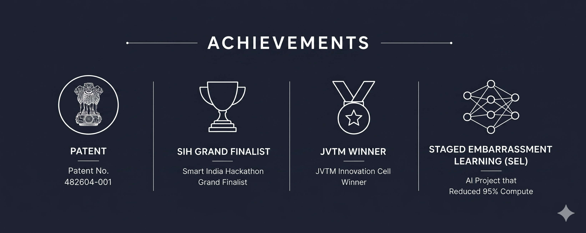
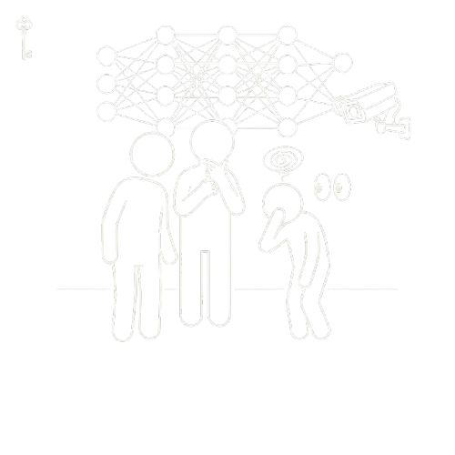
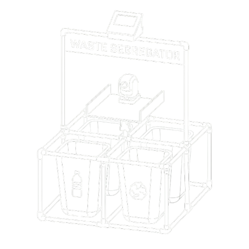
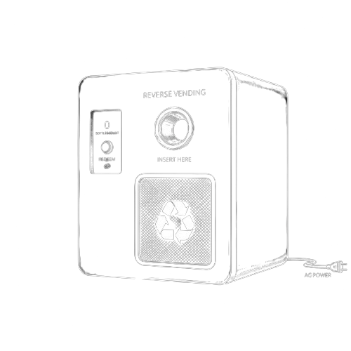

  <h1>Mohammed Ishaaq</h1>
  
<b>Engineering intelligence for the edge.</b>

  
Information Science & Engineering • BGSCET, Bengaluru

  

    
    &nbsp;&nbsp;
    
  

   
  

 

## Featured Engineering

  <table border="0" cellspacing="0" cellpadding="15">
    <tr>
      <!-- Project 1 -->
      <td align="center" valign="top" width="25%">
        <b>Staged Embarrassment Learning (v2)</b>  
          
        
        &nbsp;
        
      </td>
      <!-- Project 2 -->
      <td align="center" valign="top" width="25%">
        <b>Recylo AI Waste Segregator</b>  
          
        
        &nbsp;
        
      </td>
      <!-- Project 3 -->
      <td align="center" valign="top" width="25%">
        <b>IWM Reverse Vending Machine</b>  
          
        
        &nbsp;
        
      </td>
      <!-- Project 4 -->
      <td align="center" valign="top" width="25%">
        <b>OceanOS IoT Simulation</b>  
          
        
        &nbsp;
        
      </td>
    </tr>
  </table>
  
   
  
  

    
    &nbsp;&nbsp;
    
  

---

## About Me

I build robust, resource-constrained AI systems and solve high-impact engineering problems, focusing on architectural efficiency, computer vision, and edge deployment.

## Milestones

- **Patent Granted:** AI-driven waste segregation system (No. 482604-001).
- **Funding:** ₹1,00,000+ secured for sustainable AI development.
- **Awards & Hackathons:** JVTM National Exhibition Winner, Smart India Hackathon (SIH) Grand Finalist (120-hour hardware + software edition), and ZeroOne Runner Up.

## Technical Arsenal

   &nbsp;
   &nbsp;
   &nbsp;
   &nbsp;
   &nbsp;
   &nbsp;
   &nbsp;
  

