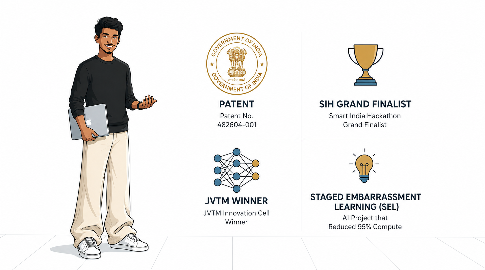

  <h1>Mohammed Ishaaq</h1>
  
<b>Engineering intelligence for the edge.</b>

  
Information Science & Engineering • BGSCET, Bengaluru

  
  

   
   

  

 

I build robust, resource-constrained AI systems and solve high-impact engineering problems, focusing on architectural efficiency, computer vision, and edge deployment.

### Milestones
- **Patent Granted:** AI-driven waste segregation system (No. 482604-001).
- **Funding:** ₹1,00,000+ secured for sustainable AI development.
- **Awards:** JVTM National Exhibition Winner & Smart India Hackathon (SIH) Grand Finalist (120-hour hardware + software edition).

### Technical Arsenal

  
  
  
  
  
  
  
  

  <h3>Selected Work & Demos</h3>
  
  
  
  
  

